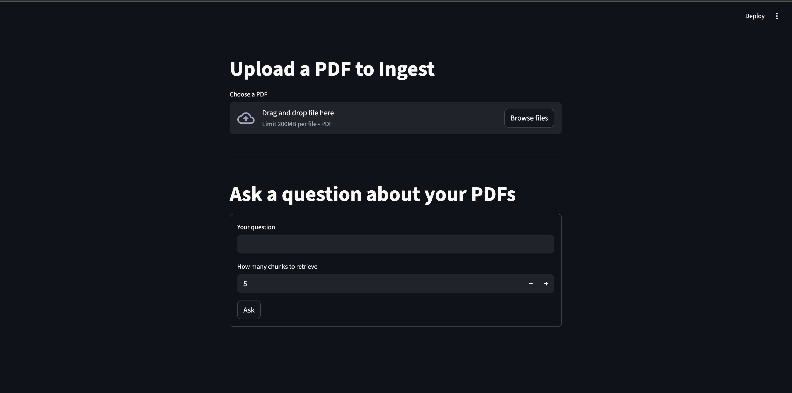
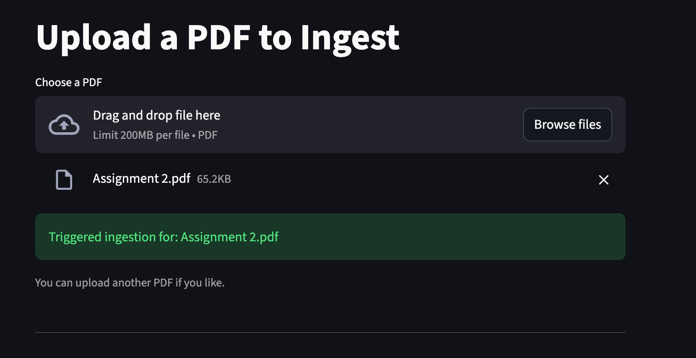
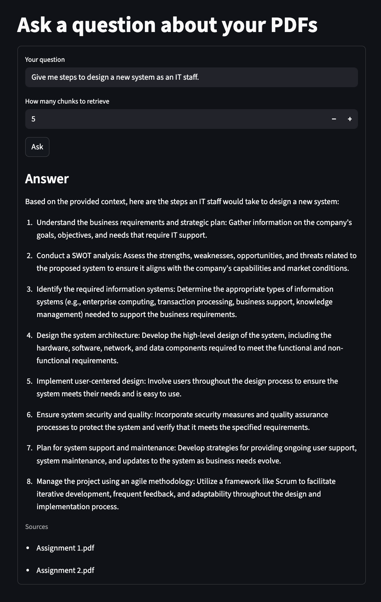

# RAGapp — Retrieval-Augmented Generation demo

This repository is a small RAG (Retrieval-Augmented Generation) demonstration that ingests PDFs, stores chunk embeddings in a vector database (Qdrant), and answers user questions by retrieving relevant chunks and calling an LLM hosted via Amazon Bedrock.

Key components
- FastAPI + Inngest: server and function orchestration (see `main.py`).
- Streamlit: simple front-end for uploading PDFs and asking questions (`streamlit_app.py`).
- Llama-Index (file reader) + SentenceSplitter: PDF reading and chunking (`data_loader.py`).
- Amazon Bedrock (via boto3): embedding and LLM model invocation (`data_loader.py` + `main.py`).
- Qdrant: local vector store for embeddings (`vector_db.py`).





High-level workflow
1. Ingest (PDF -> vectors):
   - PDF is uploaded from the Streamlit UI and saved under `uploads/`.
   - A background Inngest event (`rag/ingest_pdf`) is sent; the function in `main.py` runs the ingestion pipeline.
   - `data_loader.load_and_chunk_pdf` reads the PDF and splits it into overlapping sentence chunks.
   - `data_loader.embed_texts` calls Amazon Bedrock's embedding model (`amazon.titan-embed-text-v2:0`) to create vectors.
   - `QdrantStorage.upsert` writes ids, embeddings, and payloads (text + source) to the `docs` collection.

2. Query (question -> answer):
   - The Streamlit app sends a `rag/query_pdf_ai` Inngest event containing the question and desired `top_k`.
   - The ingestion of the event triggers `rag_query_pdf_ai` in `main.py`.
   - The question is embedded (same embed model) and the vector store is searched for the top-k closest chunks.
   - A context block composed from the retrieved chunks is sent to Bedrock to generate an answer using a Claude model via Bedrock (see `_invoke_llm` in `main.py`).

Why these tools were chosen
- Amazon Bedrock (boto3): provides managed access to both embedding and high-quality LLM models (Titan embeddings and Claude via Bedrock runtime). Using Bedrock keeps the model infra managed and lets you pick commercial LLMs.
- Qdrant: a lightweight, production-ready vector search engine with a Python client. It runs easily locally (Docker) and supports cosine/inner-product search.
- Llama-Index (file readers and SentenceSplitter): convenient, well-tested utilities for extracting text from PDFs and chunking it into overlapping passages.
- Inngest: lightweight orchestration for serverless function steps (it also provides a local dev API that the Streamlit UI polls for run outputs).
- Streamlit: fast way to build a UI for uploading files and asking questions.

Key implementation details and code snippets

1) PDF chunking and embeddings (from `data_loader.py`)

```python
from llama_index.readers.file import PDFReader
from llama_index.core.node_parser import SentenceSplitter

splitter = SentenceSplitter(chunk_size=1000, chunk_overlap=200)

def load_and_chunk_pdf(path: str):
	docs = PDFReader().load_data(file=path)
	texts = [d.text for d in docs if getattr(d, "text", None)]
	chunks = []
	for t in texts:
		chunks.extend(splitter.split_text(t))
	return chunks

def embed_texts(texts: list[str]) -> list[list[float]]:
	"""Embed a list of texts using Bedrock's embedding model.
	This function calls Bedrock one text at a time and returns a list of vectors.
	"""
	all_embeddings = []
	for text in texts:
		body = json.dumps({"inputText": text})
		response = bedrock_client.invoke_model(
			body=body,
			modelId=EMBED_MODEL,
			accept="application/json",
			contentType="application/json"
		)
		response_body = json.loads(response.get("body").read())
		embedding = response_body.get("embedding")
		all_embeddings.append(embedding)

	return all_embeddings
```

Notes: the embedding model used is `amazon.titan-embed-text-v2:0` and the embedding dimension is 1024. For production you might batch many texts per request if the API supports it; this example is intentionally simple.

2) LLM invocation via Bedrock (from `main.py` — simplified)

```python
body = {
	"anthropic_version": "bedrock-2023-05-31",
	"max_tokens": 1024,
	"temperature": 0.2,
	"system": "You answer questions using only the provided context.",
	"messages": [{"role": "user", "content": user_content}]
}

response = bedrock_client.invoke_model(
	modelId="anthropic.claude-3-haiku-20240307-v1:0",
	body=json.dumps(body),
	accept="application/json",
	contentType="application/json",
)

res = json.loads(response.get("body").read())
```

Here, `user_content` contains the concatenated retrieved chunks and the question. The project uses an Anthropic/Claude model via Bedrock in this example — replace `modelId` with a model you have access to in your AWS account.

Security and AWS configuration
- Bedrock is an AWS managed service. You must configure AWS credentials (via `~/.aws/credentials`, environment variables, or an IAM role) with permission to call `bedrock-runtime:InvokeModel`.
- The code uses boto3 to call Bedrock (see `data_loader.py` where `bedrock_client` is created). Sample `.env` entries you may need:

```dotenv
AWS_ACCESS_KEY_ID=YOUR_KEY
AWS_SECRET_ACCESS_KEY=YOUR_SECRET
AWS_DEFAULT_REGION=us-east-1
# Optional: override Qdrant / Inngest endpoints
INNGEST_API_BASE=http://127.0.0.1:8288/v1
QDRANT_URL=http://127.0.0.1:6333
```

Running the project (development)
1. Create a Python 3.12+ virtualenv and install dependencies (pyproject.toml lists them):

```bash
python -m venv .venv
source .venv/bin/activate
python -m pip install -U pip
python -m pip install .
# or install directly from pyproject dependencies with your tool (poetry/pip-tools)
```

2. Start Qdrant (local, using Docker):

```bash
# for windows
docker run -d --name qdrant -p 6333:6333 -v "$(pwd)/qdrant_storage:/qdrant/storage" qdrant/qdrant

# for macOS/linux
docker run -d --name qdrant -p 6333:6333 -v "./qdrant_storage:/qdrant/storage" qdrant/qdrant
```

3. Start the FastAPI app (Inngest functions are registered with FastAPI in `main.py`):

```bash
# from project root
uvicorn main:app 
```

4. Run the Inngest dev server (optional) or make sure your Inngest dev environment is available. The Streamlit UI polls the Inngest API to check function run outputs.
```bash
# Ensure you have nodejs installed
npx inngest-cli@latest dev -u http://127.0.0.1:8000/api/inngest --no-discovery
```


5. Run the Streamlit app for uploading PDFs and asking questions:

```bash
streamlit run streamlit_app.py
```

6. Upload a PDF using Streamlit and ask questions. The Streamlit app will send ingestion and query events to Inngest; the FastAPI app contains the function handlers that will run the pipeline.

Notes, assumptions, and next steps
- The project assumes you have Bedrock access and the chosen models available to your AWS account. If you don't have Bedrock, swap in another embedding and LLM provider (OpenAI, local LLM via LlamaCPP, etc.).
- Embeddings are currently computed one-at-a-time; batching will improve throughput and cost.
- The Qdrant collection is created with dimension 1024 and COSINE distance by default in `vector_db.py`. If you use a different embedder, update `dim` accordingly.
- The Inngest usage here demonstrates step-wise function runs (load->embed->upsert and embed->search->llm). For production, add retries, observability and limit concurrency.
- Add tests for the core functions (chunking, embedding wrapper, Qdrant upsert/search) and a small integration smoke test that uses a tiny PDF.

Files of interest
- `main.py` — Inngest functions and orchestration.
- `streamlit_app.py` — lightweight UI for upload and query.
- `data_loader.py` — PDF loading, chunking, and embedding (Bedrock usage).
- `vector_db.py` — Qdrant wrapper for upsert/search.
- `custom_types.py` — Pydantic models used by the Inngest functions.
---
